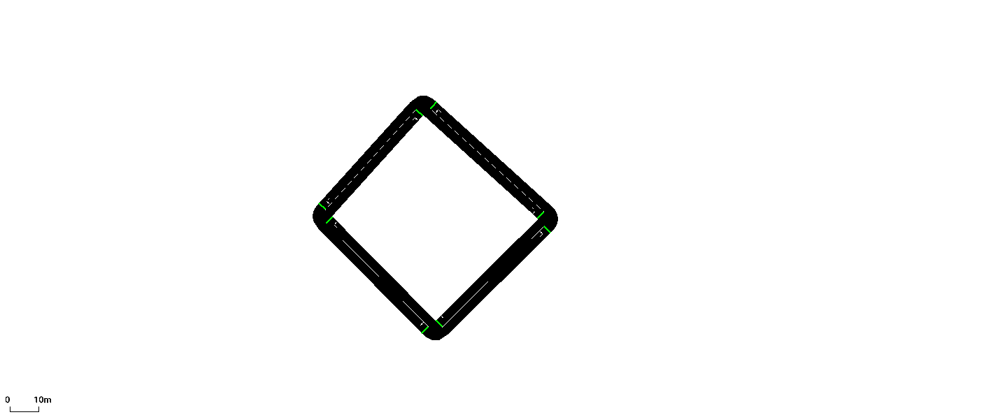
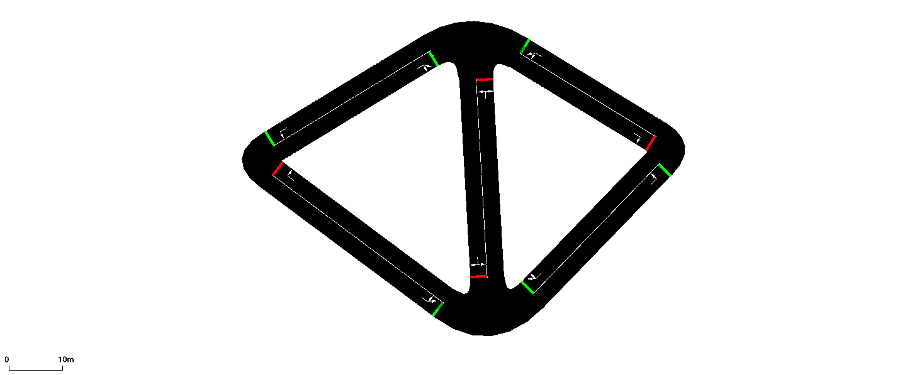

# BraessParadoxSumo
This repository contains some simple implementations of the Brasess' Paradox theorem as it relates to road networks. The simulations are done using the Simulation for Urban Mobility (SUMO) software 

Run sumo configuration file in terminal with this command: sumo-gui bp1.sumocfg 

Run sumo configuration file in terminal with this command : bp2.sumocfg 

